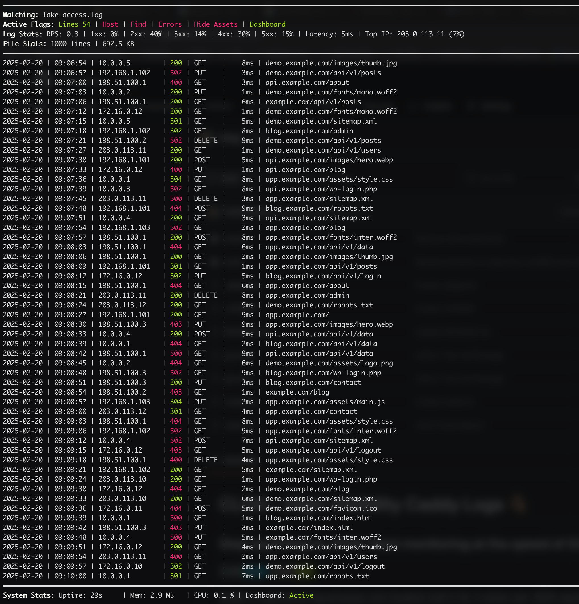
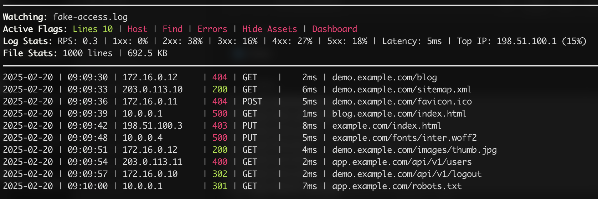
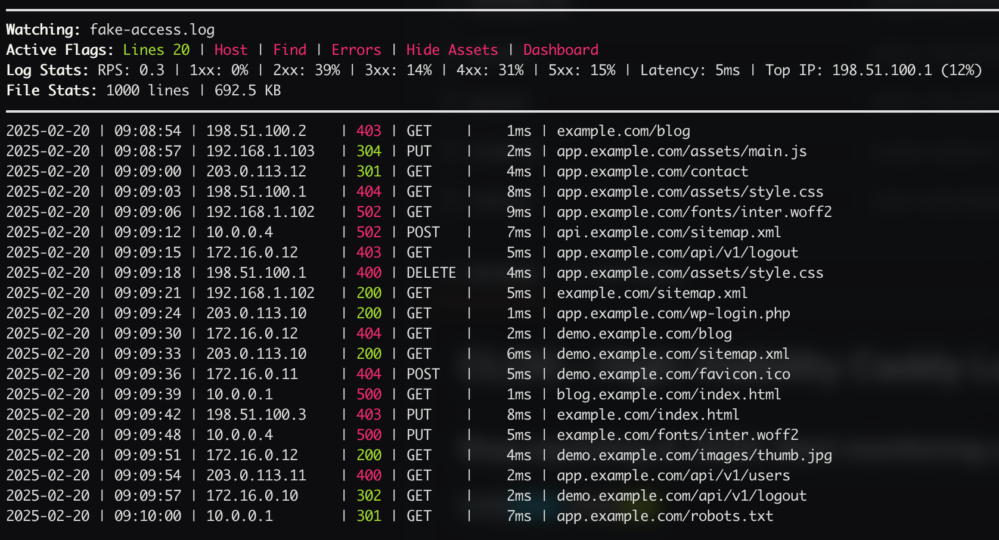
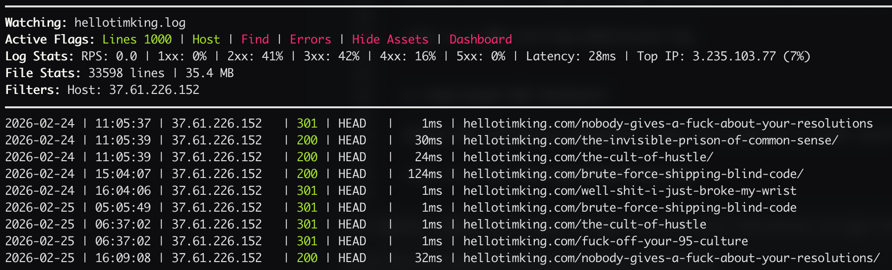
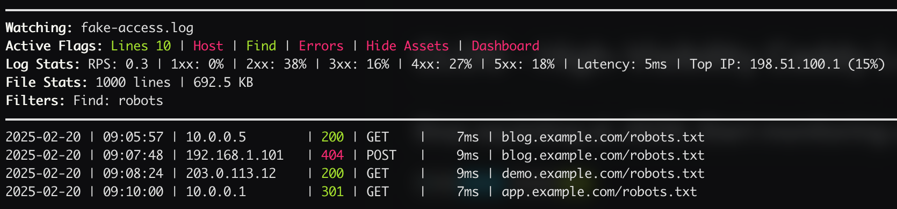
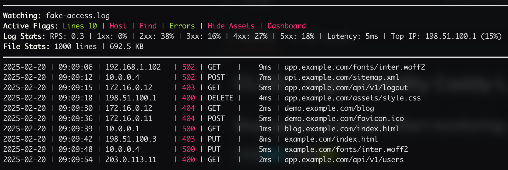
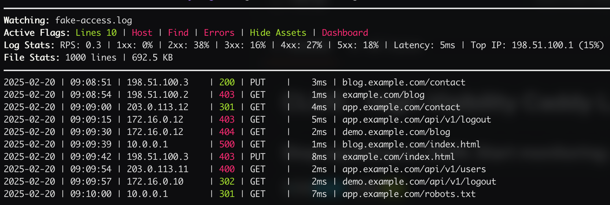

# CLOG - High-Visibility Caddy Logs 🪵
## Stop squinting at JSON. Start monitoring at the speed of Go.

[](https://github.com/hellotimking/clog)
[](LICENSE)

**CLOG** is a specialized log processor and visualizer built in Go. It solves user JSON-squinting by transforming Caddy's structured logs into an interactive, human-centric dashboard. Designed for systems administrators and developers who need instant situational awareness without the overhead of heavy logging stacks.

**Transforming messy, hard-to-read JSON streams into a clean, actionable visual interface.**

---

- [Features](#-features)
- [Dashboard Mode](#-dashboard-mode)
- [How to Install CLOG](#-how-to-install-clog)
- [Command Line Interface](#-command-line-interface)
- [How to Use](#-how-to-use)
- [License](#-license)
  
---

## 😀 Features

* **⚡ Zero-Latency Streaming:** Uses non-blocking I/O and optimized Go channels to handle high-traffic environments without dropping frames.
* **📊 Real-time Analytics:** Instant status code distribution (2xx, 3xx, 4xx, 5xx) visualized in the TUI.
* **🔍 Power Filtering:** Regex-based or field-specific filtering to isolate problematic endpoints or specific status codes.
* **👀 Schema Aware:** Deep understanding of Caddy's default JSON log structure—no configuration required.
* **🎨 Responsive TUI:** Built with a terminal UI that scales from small side-panes to full-screen NOC displays.
* **⬇️ Low CPU Overhead:** Log parsing happens in parallel worker pools using Go routines.
* **🧠 Predictable Memory:** Uses a fixed-size ring buffer for history to prevent memory leaks.
* **🏎️ Efficiency:** Capable of processing thousands of lines per second with negligible latency.

---

## 🖥️ Dashboard Mode

Activated with the --dashboard or -d flag, this mode transforms clog from a simple log tailer into a full-scale Network Operations Center (NOC) display.

**The dashboard provides a high-fidelity, 1-second interval overview of your server's health:**
* **Real-time Metrics:** Tracks live Requests Per Second (RPS) and cumulative request counts to identify traffic spikes as they happen.
* **Status Distribution:** A visual breakdown of HTTP status codes (Success vs. Client/Server Errors). This allows you to distinguish between a healthy traffic surge and a coordinated DDoS or application failure at a glance.
* **System Awareness:** When combined with the -s flag, it embeds a resource monitor showing CPU and Memory utilization, allowing you to correlate log spikes with hardware bottlenecks.
* **Non-Blocking Engine:** Built on a polling architecture that reads from the tail of the log without locking the file, ensuring zero impact on your web server's performance.

Additionally, to add the status bar to the bottom to see uptime, memory use, and CPU use use the --status or -s flag

### To activate dashboard mode:
```
clog -d -s /var/log/caddy/access.log
```

### Dashboard Mode Screenshot


---

## 🚀 How to Install CLOG

### From Source
**Requires Go 1.21 or higher.**

#### Clone the repository
```bash
git clone https://github.com/hellotimking/clog.git
cd clog
```

#### Build optimized binary
```
go build -ldflags="-s -w" -o clog
```
#### Global install
```
sudo mv clog /usr/local/bin/
```
---

## 🚀 Command Line Interface

| Switch | Long Flag | Description |
| :---- | :---- | :---- |
| \-l | \--lines | Number of previous lines to show from the log file. |
| \-h | \--host | Only show logs for a specific domain or IP address. |
| \-f | \--find | Only show lines containing a specific string. |
| \-e | \--errors | Only show requests with status code \>= 400\. |
| \-ha | \--hide-assets | Hides common asset types (.js, .css, images, etc). |
| \-a | \--all | Show entire history and ignore asset filters. |
| \-s | \--status | Show system resource bar at the bottom of the terminal. |
| \-d | \--dashboard | Enable 1-second dashboard mode for real-time metrics. |
| \-c | \--clear-screen | Clear terminal before starting and on exit. |
| \ | \--help | Show the help menu and usage instructions. |

----

## 💡 How to Use

### Basic log tailing
Simply point **clog** at your Caddy access log to see a cleaned-up, human-readable stream and it will print the last 10 lines in the log and continue to tail until stopped (CTRL + C):
```
clog /path/to/access.log
```


---

### Specify number of lines
If you'd like to specify the number of lines to begin with:
```
clog --lines 20 /path/to/access.log
```


---

### Limit to host
If you want to limit the tail to a specific host:
```
clog --host <ip address or host> /path/to/access.log
```


---

### Finding specific urls
If you're searching for a specific url, you can define a string to search for:
```
clog --find <text to find> /path/to/access.log
```


---

### Limiting to errors only
If you'd like to see only errors:
```
clog --errors /path/to/access.log
```


--- 

### Hiding assets
Sometimes you'll want to hide asset-type files to see cleaner results (images, audio, video, JS, css, and more)
```
clog --hide-assets /path/to/access.log
```


---

### Clear Screen
If you'd like to clear the screen before and after running CLOG:
```
clog --clear-screen /path/to/access.log
```

---

## License
This project is licensed under the MIT License - see the [LICENSE](LICENSE) file for more details.
